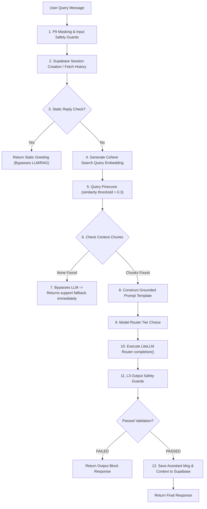

# Core Agent Engine & Request Lifecycle Coordinator

This document outlines the design and internal workflows of the **Core Agent Engine** defined in [agent.py](file:///c:/Users/Admin/Downloads/amicorp-ai-assistant/Backend/agent.py).

The Agent Engine coordinates the overall chat lifecycle: input validation, static response checks, RAG embedding and vector search, dynamic model selection, LLM inference execution, and post-generation safety checks.

---

## 1. Agent Runtime Flowchart

The flowchart below represents the execution pipeline of a query entering `run_chat_agent()`:

---

## 2. Functions & Subsystem Roles

The orchestrator combines multiple utilities to execute standard and streaming workflows:

### **1. Session & History Integrations (Supabase)**
* [fetch_conversation_history](file:///c:/Users/Admin/Downloads/amicorp-ai-assistant/Backend/agent.py#L114-L130): Fetches past dialogue exchanges from the `messages` table for the specified `conversation_id` to establish chat context.
* [create_supabase_conversation](file:///c:/Users/Admin/Downloads/amicorp-ai-assistant/Backend/agent.py#L133-L149): Registers a new conversation session and automatically titles it using the first 60 characters of the masked query.
* [save_supabase_message](file:///c:/Users/Admin/Downloads/amicorp-ai-assistant/Backend/agent.py#L152-L168): Records the message role, content, and the RAG search metadata (for assistant replies) into the database for auditing and citation tracking.

### **2. Vector Retrieval (Cohere + Pinecone)**
* [get_cohere_embedding](file:///c:/Users/Admin/Downloads/amicorp-ai-assistant/Backend/agent.py#L56-L81): Takes the cleansed user query and vectorizes it into a 384-dimensional dense vector using Cohere's `embed-english-light-v3.0` API.
* [query_pinecone](file:///c:/Users/Admin/Downloads/amicorp-ai-assistant/Backend/agent.py#L83-L110): Submits the query vector to Pinecone index `amicorp-kb`. The agent filters matches to those with a similarity score **`> 0.3`**.

---

## 3. Runtime Engines

### **Standard Runtime (`run_chat_agent`)**
Executes a synchronous request-response flow. It is optimized to fail fast:
1. Cleans and masks the query.
2. Checks input safety via the `L1` guardrail.
3. Intercepts static greetings.
4. Searches the vector database.
5. **Early Fallback:** If search matches are empty, it halts execution and returns a pre-configured support response immediately, preventing any out-of-scope model generations or hallucinations.
6. Calls `router.completion()` for model execution.
7. Performs `L3` output guardrail checks, logs details to Supabase, and returns the response payload.

### **Streaming Runtime (`run_chat_agent_stream`)**
Executes a stateful Server-Sent Events (SSE) streaming flow. 
* Emits a starting metadata block containing the `conversation_id`.
* Checks input safety and static replies (returns static responses in a single stream block).
* Runs RAG vector search. If no context is found, it yields the support fallback block and completes the stream.
* Yields streaming tokens from the LiteLLM router endpoint incrementally, saving database audit parameters at the conclusion of the stream.
