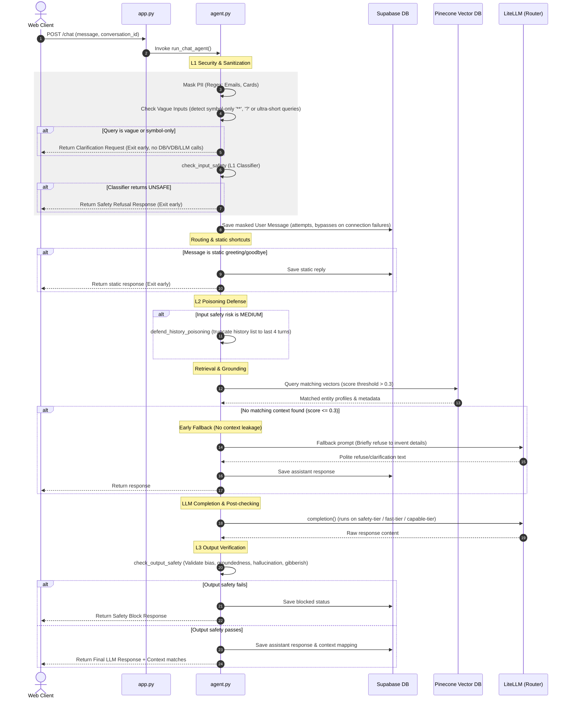

# Codebase Context: Amicorp AI Assistant

This document provides a comprehensive technical blueprint of the **Amicorp AI Structuring Advisor & Support Assistant**. It is designed to give LLMs or developers instant structural, logical, and procedural context for building, modifying, or querying this repository.

---

## 📂 Directory Map & File Roles

```text
amicorp-ai-assistant/
│
├── Backend/                            # FastAPI Backend Application
│   ├── app.py                          # HTTP API Server entry point (FastAPI)
│   ├── agent.py                        # RAG Coordinator & request lifecycle manager
│   │
│   ├── core/                           # System Configuration & Core Prompts
│   │   ├── config.py                   # Environment variable loader with safe defaults
│   │   └── prompts.py                  # Grounding templates, safety classifiers & taxonomy
│   │
│   ├── routers/                        # Intent & Decision Tier Routers
│   │   ├── intent_router.py            # Regex-based static greetings & LLM route classifier
│   │   └── model_router.py             # Logic choosing fast-tier vs capable-tier
│   │
│   ├── services/                       # Third-Party Integrations & Safety Logic
│   │   ├── llm_service.py              # LiteLLM Router config, cache settings & LLM classifiers
│   │   ├── guardrails_service.py       # Custom Guardrails AI validators (PII, bias, groundedness)
│   │   └── redis_service.py            # Redis client initialization & wrapper functions
│   │
│   ├── SQL_migrations/                 # DB migrations for conversations/messages schema
│   ├── requirements.txt                # Python backend dependencies (litellm, guardrails-ai, fastapi)
│   └── .env                            # Backend local variables (keys, index details, support email)
│
├── Frontend/                           # TanStack Start & React Web Application
│   └── [Web Application Structure]     # Portal UI showing recommended structures & SSE chat widget
│
├── dev environment/                    # Isolated Development Sandbox
│   ├── knowledge_base.json             # Source corporate knowledge profile data
│   ├── setup_dev_rag.py                # Embedding compilation & Pinecone index sync script
│   └── test_dev_query.py               # Local diagnostic querying script
│
├── guardrails.md                       # Security architecture flowchart & summary
└── lovable_prompt.md                   # Rebuilding requirements for Lovable frontend
```

---

## ⚙️ Technology Stack

1. **Backend Framework**: FastAPI (Uvicorn server)
2. **LLM Orchestration**: LiteLLM (dynamic routing, load-balancing, inside-tier retries, fallback routing)
3. **Database & Persistence**: Supabase (PostgreSQL database storing user sessions & chat history)
4. **Vector Database**: Pinecone (holding 384-dimension semantic document chunks)
5. **Embeddings Engine**: Cohere (`embed-english-light-v3.0` producing 384-dimension vectors)
6. **Caching Layer**: Redis (caching embedding vectors & conversation history)
7. **Safety Framework**: Guardrails AI + custom Python classifiers (L1, L2, L3 safety guards)

---

## 🔄 Request Lifecycle & RAG Flow



---

## 🔀 LiteLLM Multi-Key, Multi-Provider Model Routing

The model routing system uses LiteLLM's `Router` in `llm_service.py` to route queries across multiple tiers. Multiple models are registered under each tier name. The router automatically uses `usage-based-routing-v2` to load-balance across keys and models, retrying internally up to 3 times before falling back.

### 1. Model Tiers Definition

| Tier | Primary Use Case | Target Models (Free Tier) | Providers |
|---|---|---|---|
| **`fast-tier`** | Greetings, classification, low-complexity tools | `llama-3.1-8b-instant`, `llama-3.2-11b`, `qwen3-8b`, `gemma-3-12b`, `gemini-2.5-flash-lite` | Groq, OpenRouter, Gemini |
| **`capable-tier`** | Detailed RAG answers, entity analysis | `llama-3.3-70b`, `deepseek-r1-70b`, `deepseek-chat-v3`, `qwen3-72b`, `hermes-3-405b`, `gemini-2.5-flash` | Groq, OpenRouter, Gemini |
| **`safety-tier`** | Safety classifiers (input/output check) | `llama-3.3-70b`, `deepseek-r1-70b`, `deepseek-chat-v3`, `qwen3-72b`, `hermes-3-405b`, `gemini-2.5-flash` | Groq, OpenRouter, Gemini |

### 2. Multi-Key Fallback Logic
* API credentials in `.env` are structured as arrays (`GROQ_API_KEY_1`, `GROQ_API_KEY_2`, etc.).
* If a primary key experiences rate-limits (`429`) or server failures, the router immediately cycles to the next key or provider in the tier.
* If a tier is completely exhausted, cross-tier fallback is triggered:
  - `fast-tier` $\rightarrow$ `capable-tier`
  - `safety-tier` $\rightarrow$ `capable-tier`

---

## 🔒 Safety Guardrails Design (Fail-Closed Architecture)

Any exception in the safety validation flow defaults to a **fail-closed deny**. If validators crash or timeout, the request is rejected immediately with a `[SAFETY-ALERT]` logged.

### Layer 1: Input Check
- **PII Masking**: Regex patterns detect and mask credit cards and emails.
- **Vague Check**: Bypasses full pipeline if the input has no alphanumeric text (e.g. `**`).
- **Input safety classifier**: System prompt enforces safety taxonomy with few-shot examples. Uses `stop=["\n"]` to prevent model preambles and bypass logic.

### Layer 2: History Protection
- **Crescendo defense**: Truncates session history if the safety classifier marks input risk level as `MEDIUM`, preventing adversarial multi-turn builds.

### Layer 3: Output Check
- **Output safety classifier**: Compares final text against target grounding context.
- **Validators**: Verifies output is not gibberish, holds no PII, has no bias, and matches retrieval context.

---

## 🛠️ Development Sandbox & Vector Ingestion

The sandbox directory (`dev environment/`) houses tools for testing:
* **Ingestion Script (`setup_dev_rag.py`)**: Iterates through `knowledge_base.json`, compiles all structure fields (LMT members, setup times, pricing, ideal use cases, risks) into a highly descriptive string, and creates embeddings.
* **Dimensional Alignment**: Pinecone indices are standardized to **384 dimensions** (matching Cohere `embed-english-light-v3.0` vectors) using the **cosine** metric.
