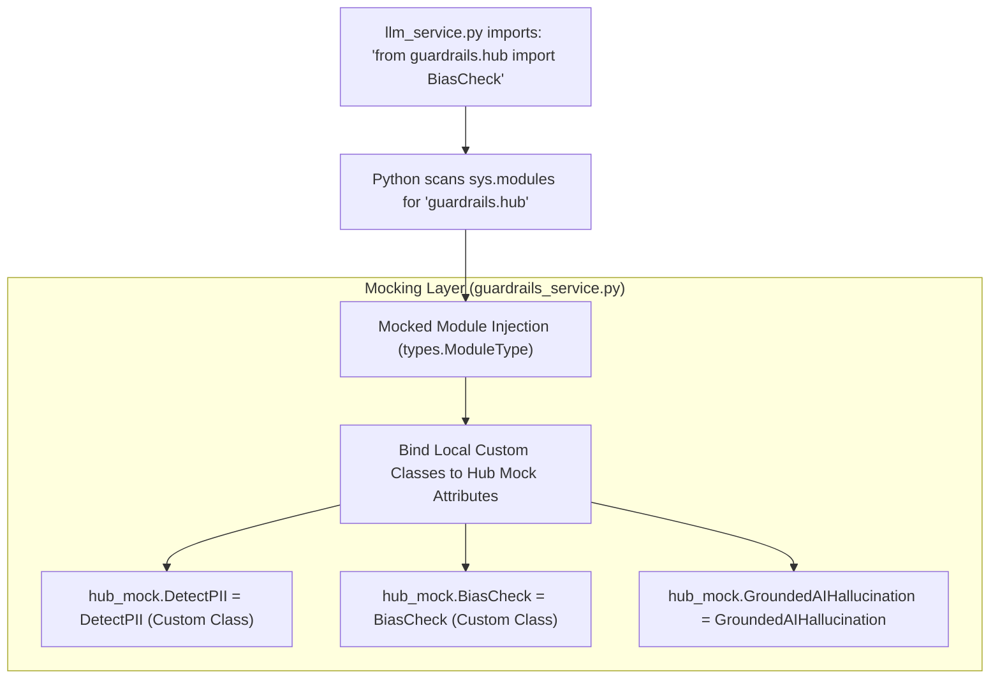

# Guardrails Service & Custom Validators

This document outlines the design, dynamic mocking architecture, and logic of the custom validator service defined in [guardrails_service.py](file:///c:/Users/Admin/Downloads/amicorp-ai-assistant/Backend/services/guardrails_service.py).

---

## 1. Dynamic Module Mocking Architecture

During production builds (such as on Render), downloading heavy AI models (e.g. spacy, transformers, NLTK) required by official Guardrails Hub packages often leads to download timeouts, package version conflicts, or memory crashes.

To circumvent this, the backend dynamically mocks the `guardrails.hub` module in Python memory at startup:



* **Implementation:** 
  In [guardrails_service.py:L201-203](file:///c:/Users/Admin/Downloads/amicorp-ai-assistant/Backend/services/guardrails_service.py#L201-L203), the service creates a raw python module `types.ModuleType("guardrails.hub")` and registers it directly into `sys.modules["guardrails.hub"]`. 
* **Dynamic Binding:**
  Local custom classes are then bound to this module object (e.g. `hub_mock.DetectPII = DetectPII`), allowing other parts of the application to import them using standard `from guardrails.hub import DetectPII` syntax.

---

## 2. Validator Class Reference

The service defines several local classes inheriting from the base `Validator` class. If the base Guardrails library is unavailable or throws import errors, [guardrails_service.py](file:///c:/Users/Admin/Downloads/amicorp-ai-assistant/Backend/services/guardrails_service.py#L12-L24) provides simple local fallbacks for `Validator`, `PassResult`, and `FailResult` to prevent application crashes.

### **1. PII Detection (`DetectPII` / `GuardrailsPII`)**
* **Logic:** Uses regular expression patterns to scan for credit cards and email formats:
  ```regex
  Credit Cards: \b(?:\d[ -]*?){13,16}\b
  Emails: \b[A-Za-z0-9._%+-]+@[A-Za-z0-9.-]+\.[A-Z|a-z]{2,}\b
  ```
* **Response:** Returns `FailResult` if any matches are found, blocking the output or prompt.

### **2. Hallucination Detection (`GroundedAIHallucination`)**
* **Logic:** Checks overlaps between the LLM output text and the retrieved Pinecone documentation context stored in the message metadata.
* **Response:** Fails if the output lacks grounding (less than 15% text overlap with the document chunks).

### **3. Prompt Injection Detector (`PromptInjectionDetector`)**
* **Logic:** Scans input strings for dangerous instructions or system overrides (e.g., *"ignore previous instructions"*, *"system prompt"*, *"jailbreak"*).
* **Response:** Fails if injection indicators are detected.

### **4. Gibberish Detection (`GibberishText`)**
* **Logic:** Checks the fraction of special/non-alphanumeric characters in the LLM response text.
* **Response:** Fails if the fraction exceeds a threshold of 50%, indicating that the LLM has degenerated into loops or noise.

### **5. Bias Check (`BiasCheck`)**
* **Logic:** A placeholder class verifying demographic objectivity (age, disability, gender, race).
* **Response:** Returns `PassResult` by default for lightweight operation.
