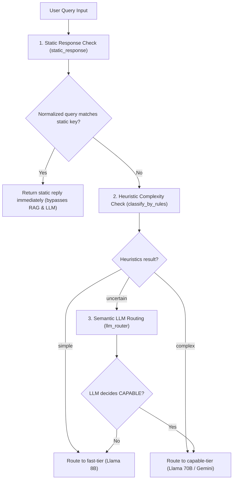

# Intent Routing & Static Response Map

This document outlines the internal logic and workflow of the **Intent Router** defined in [intent_router.py](file:///c:/Users/Admin/Downloads/amicorp-ai-assistant/Backend/routers/intent_router.py). 

The Intent Router's primary task is to intercept routine user requests (like greetings or goodbye phrases) and return static replies immediately, completely bypassing vector database search and LLM inference.

---

## 1. Intent Decision Flowchart

The following flowchart outlines how queries are routed through the static response map and model classifiers:

---

## 2. Component Logic

### **1. Static Response Interceptor**
Implemented in [static_response](file:///c:/Users/Admin/Downloads/amicorp-ai-assistant/Backend/routers/intent_router.py#L11-L200), this function strips trailing punctuation and normalizes casing to match incoming queries against a dictionary of predefined static responses.
* **Benefits:** 
  * Bypasses Cohere embedding generation, saving API costs.
  * Bypasses Pinecone vector query, eliminating latency.
  * Bypasses LiteLLM completion call entirely, cutting token consumption.
* **Categories Handled:**
  * **Greetings:** *"hello"*, *"hi"*, *"hey"*, *"good morning"*, *"good afternoon"*, etc.
  * **Goodbyes:** *"bye"*, *"see you"*, *"take care"*, etc.
  * **Politeness/Assistance:** *"thanks"*, *"thank you"*, *"appreciate it"*, *"help"*, *"can you help me"*, etc.
  * **Identity/Status Check:** *"who are you"*, *"what are you"*, *"are you a robot"*, *"status"*, *"ping"*, etc.
  * **Filler Responses:** *"ok"*, *"okay"*, *"yes"*, *"no"*, *"maybe"*, etc.

### **2. Heuristic Complexity Check**
Implemented in [classify_by_rules](file:///c:/Users/Admin/Downloads/amicorp-ai-assistant/Backend/routers/intent_router.py#L202-L228), this parses length and query structure to classify query complexity:
* **Complex Indicator:** Message length **$> 500$ characters** OR containing complex operational keywords (e.g., `"analyze"`, `"architecture"`, `"optimize"`, `"debug"`, `"medical"`).
* **Simple Indicator:** Message length **$< 50$ characters**.
* **Fallback (`uncertain`):** Messages between 50 and 500 characters with no complex keywords require semantic routing.

### **3. Semantic LLM Router**
Implemented in [llm_router](file:///c:/Users/Admin/Downloads/amicorp-ai-assistant/Backend/routers/intent_router.py#L230-L244), this uses a fast LLM to parse intent:
* **Prompt:** Uses `ROUTER_SYSTEM_PROMPT` in `prompts.py` to classify query complexity.
* **Output:** Returns `FAST` or `CAPABLE` to specify the model tier routing.
