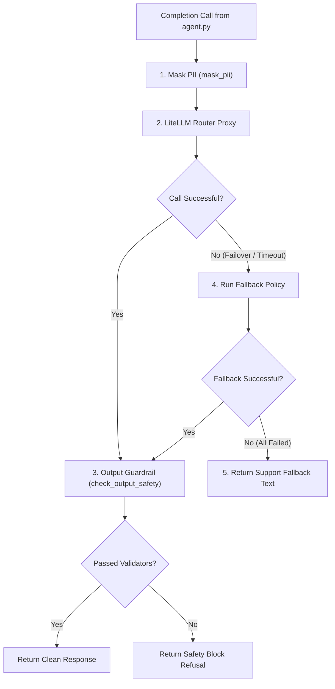

# LLM Service Configuration & API Integration

This document outlines the design and internal logic of the **LLM Service Layer** defined in [llm_service.py](file:///c:/Users/Admin/Downloads/amicorp-ai-assistant/Backend/services/llm_service.py). 

This service acts as the gateway to all language model completions, orchestrating model lists, fallback routing policies, PII masking, and security firewall guards.

---

## 1. Subsystem Workflow

---

## 2. Component Breakdown

### **1. LiteLLM Router Proxy**
The backend utilizes LiteLLM's `Router` class to manage model endpoints, API keys, and timeouts. This provides a unified API interface (`router.completion()`) regardless of the vendor (Groq, Gemini, etc.).

* **Model Registry:** 
  * `fast-tier`: Maps primary completions to `groq/llama-3.1-8b-instant`.
  * `capable-tier`: Maps primary completions to `groq/llama-3.3-70b-versatile`.
  * `gemini-2.5-flash` / `gemini-3.1-flash-lite`: Used for fallback policies.
* **Failover Fallback Policies:**
  * If the primary `fast-tier` model fails, the router automatically fails over to `gemini-2.5-flash-lite`, then `gemini-2.5-flash`, and finally `gemini-3.1-flash-lite`.
  * If the primary `capable-tier` model fails, the router automatically fails over to `gemini-2.5-flash`.

### **2. Input & Output Safety Guards**
* **PII Masking (`mask_pii`):** Scans prompts using regular expressions to replace emails and credit cards with safe placeholders before they are transmitted to external model providers.
* **Input Guard (`input_guard`):** A validation pipeline checking the prompt against `PromptInjectionDetector` and `DetectPII` to ensure the input contains no malicious payloads.
* **Output Guard (`output_guard`):** A validation chain executing:
  * `GibberishText`: Checks language coherence.
  * `GroundedAIHallucination`: Validates claims against Pinecone context.
  * `GuardrailsPII`: Verifies that no sensitive personal data was leaked in the response.
  * `BiasCheck`: Analyzes the response to ensure there is no demographic or social bias.
