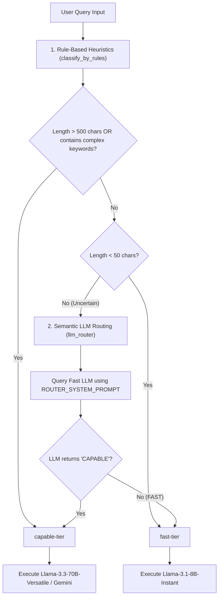

# Model Routing System and Internal Logic

This document details the internal logic and workflow of the dynamic **Model Routing System** used in the AMICORP AI Assistant backend. 

Model routing ensures that simple requests are handled by low-latency, lower-cost models, while complex or safety-sensitive requests are directed to larger, more capable models.

---

## 1. Routing Decision Flowchart

The following flowchart outlines the multi-tiered decision process of the model router:

---

## 2. Internal Routing Logic

The routing engine operates in two sequential stages: **Rule-Based Heuristics** and **Semantic LLM Classification**.

### **Stage 1: Rule-Based Heuristics**
Implemented in [classify_by_rules](file:///c:/Users/Admin/Downloads/amicorp-ai-assistant/Backend/routers/intent_router.py#L202-L228), this phase is instantaneous and avoids unnecessary API calls:
* **Complexity Flags:** If the query contains complex keywords (`"analyze"`, `"compare"`, `"design"`, `"architecture"`, `"optimize"`, `"debug"`, `"medical"`, `"finance"`, `"algorithm"`, `"system"`), it immediately maps to the **capable-tier**.
* **Length Constraints:** 
  * Queries **$> 500$ characters** are assumed to be complex and route to the **capable-tier**.
  * Queries **$< 50$ characters** are assumed to be simple (e.g. *"What is an IBC?"*) and route to the **fast-tier**.
* **Uncertainty Fallback:** Queries between 50 and 500 characters that do not contain the specified keywords are flagged as `uncertain` and fall back to Stage 2.

### **Stage 2: Semantic LLM Routing**
Implemented in [llm_router](file:///c:/Users/Admin/Downloads/amicorp-ai-assistant/Backend/routers/intent_router.py#L230-L244), this phase uses a fast, lightweight LLM (`fast-tier` model) to determine semantic intent:
* **Classification Prompt:** The model is queried using `ROUTER_SYSTEM_PROMPT` in [prompts.py](file:///c:/Users/Admin/Downloads/amicorp-ai-assistant/Backend/core/prompts.py). It instructs the model to return exactly one token: `FAST` or `CAPABLE`.
* **Output Processing:**
  * If the model responds with `CAPABLE` (meaning the task requires code help, multi-step analysis, planning, or is safety-sensitive), the router maps it to the **capable-tier**.
  * Otherwise, it defaults to the **fast-tier**.

---

## 3. Model Tiers Mapping

The routes mapped by the router correspond to the following model backends configured in `llm_service.py`:

| Routing Tier | Primary Model Backend | Fallback Options | Best Suited For |
| :--- | :--- | :--- | :--- |
| **`fast-tier`** | Groq `llama-3.1-8b-instant` | Gemini Flash Lite, Gemini Flash | Short Q&A, greetings, formatting transformations. |
| **`capable-tier`** | Groq `llama-3.3-70b-versatile` | Gemini Flash | High-reasoning compliance analysis, document summarization, complex planning. |
